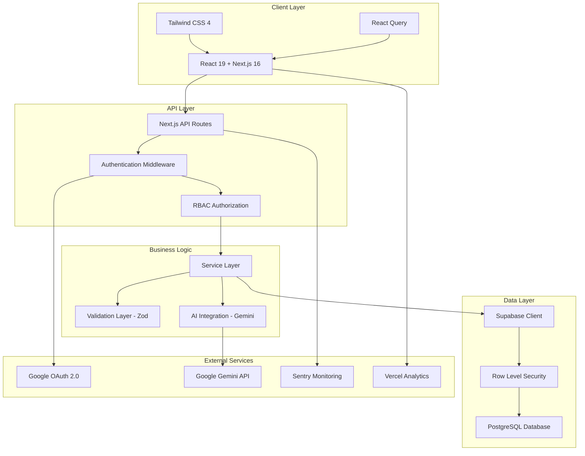
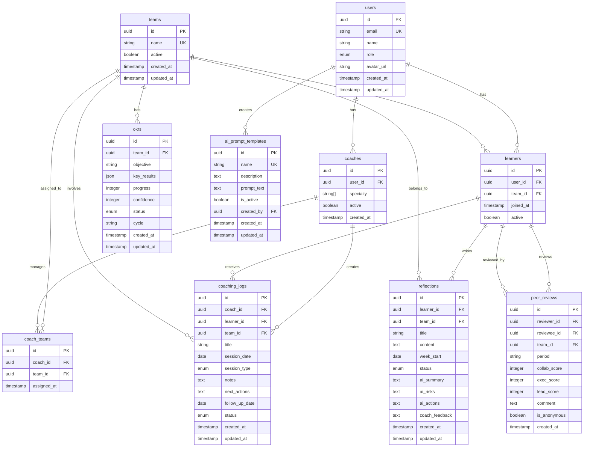

# LEINN LMS 개발자 가이드

## 📋 목차

1. [시스템 아키텍처](#시스템-아키텍처)
2. [기술 스택](#기술-스택)
3. [프로젝트 구조](#프로젝트-구조)
4. [데이터베이스 설계](#데이터베이스-설계)
5. [API 설계](#api-설계)
6. [개발 환경 설정](#개발-환경-설정)
7. [코딩 가이드라인](#코딩-가이드라인)
8. [테스트 전략](#테스트-전략)
9. [배포 및 CI/CD](#배포-및-cicd)
10. [모니터링 및 로깅](#모니터링-및-로깅)
11. [성능 최적화](#성능-최적화)
12. [보안 고려사항](#보안-고려사항)
13. [트러블슈팅](#트러블슈팅)

---

## 🏗️ 시스템 아키텍처

### 전체 아키텍처 다이어그램



### 핵심 설계 원칙

#### 1. **역할 기반 접근 제어 (RBAC)**
- **학습자**: 자신의 리플렉션만 조회/작성
- **코치**: 담당 팀의 리플렉션 조회 및 피드백 작성
- **관리자**: 전체 시스템 관리 권한

#### 2. **AI 기반 워크플로우**
```
리플렉션 제출 → AI 분석 (Gemini) → 코치 검토 → 최종 피드백
```

#### 3. **보안 우선 설계**
- Row Level Security (RLS) 정책
- JWT 기반 인증
- API 레벨 권한 검증

---

## 🛠️ 기술 스택

### Frontend
| 기술 | 버전 | 용도 |
|------|------|------|
| **Next.js** | 16.0.2 | 풀스택 React 프레임워크 |
| **React** | 19.2.0 | UI 라이브러리 |
| **TypeScript** | 5.x | 타입 안전성 |
| **Tailwind CSS** | 4.x | 스타일링 |
| **React Query** | 5.90.8 | 서버 상태 관리 |
| **React Hook Form** | 7.66.0 | 폼 관리 |
| **Zod** | 4.1.12 | 스키마 검증 |

### Backend & Database
| 기술 | 버전 | 용도 |
|------|------|------|
| **Supabase** | 2.81.1 | BaaS (인증, 데이터베이스) |
| **PostgreSQL** | 15+ | 관계형 데이터베이스 |
| **Google Gemini** | 0.24.1 | AI 분석 엔진 |

### DevOps & Monitoring
| 기술 | 버전 | 용도 |
|------|------|------|
| **Vercel** | - | 배포 플랫폼 |
| **Sentry** | 10.25.0 | 에러 모니터링 |
| **Jest** | 30.2.0 | 단위 테스트 |
| **Playwright** | 1.56.1 | E2E 테스트 |

---

## 📁 프로젝트 구조

```
leinn-lms/
├── app/                          # Next.js App Router
│   ├── (admin)/                  # 관리자 페이지 그룹
│   │   ├── teams/               # 팀 관리
│   │   ├── users/               # 사용자 관리
│   │   └── ai-prompts/          # AI 프롬프트 관리
│   ├── (coach)/                  # 코치 페이지 그룹
│   │   ├── dashboard/           # 코치 대시보드
│   │   ├── teams/               # 담당 팀 관리
│   │   └── coaching-logs/       # 코칭 로그
│   ├── (learner)/                # 학습자 페이지 그룹
│   │   ├── dashboard/           # 학습자 대시보드
│   │   └── reflections/         # 리플렉션 관리
│   ├── api/                      # API Routes
│   │   ├── auth/                # 인증 관련 API
│   │   ├── reflections/         # 리플렉션 API
│   │   ├── teams/               # 팀 관리 API
│   │   ├── coaching-logs/       # 코칭 로그 API
│   │   └── ai-prompts/          # AI 프롬프트 API
│   ├── auth/                     # 인증 페이지
│   ├── globals.css              # 전역 스타일
│   ├── layout.tsx               # 루트 레이아웃
│   ├── page.tsx                 # 홈페이지
│   ├── loading.tsx              # 전역 로딩 UI
│   └── error.tsx                # 전역 에러 UI
├── components/                   # React 컴포넌트
│   ├── admin/                   # 관리자 컴포넌트
│   ├── coach/                   # 코치 컴포넌트
│   ├── learner/                 # 학습자 컴포넌트
│   ├── dashboard/               # 대시보드 컴포넌트
│   ├── reflections/             # 리플렉션 컴포넌트
│   ├── layout/                  # 레이아웃 컴포넌트
│   ├── auth/                    # 인증 컴포넌트
│   └── ui/                      # 재사용 가능한 UI 컴포넌트
├── lib/                         # 라이브러리 및 유틸리티
│   ├── ai/                      # AI 관련 로직
│   │   ├── gemini-client.ts     # Gemini API 클라이언트
│   │   ├── analyzer.ts          # AI 분석 로직
│   │   ├── prompts.ts           # 프롬프트 템플릿
│   │   └── prompt-loader.ts     # 동적 프롬프트 로더
│   ├── auth/                    # 인증 관련
│   │   ├── auth-provider.tsx    # 인증 컨텍스트
│   │   ├── hooks.ts             # 인증 훅
│   │   └── rbac.ts              # 역할 기반 접근 제어
│   ├── supabase/                # Supabase 클라이언트
│   │   ├── client.ts            # 브라우저 클라이언트
│   │   └── server.ts            # 서버 클라이언트
│   ├── services/                # 비즈니스 로직
│   │   ├── reflection-service.ts
│   │   ├── team-service.ts
│   │   ├── coaching-log-service.ts
│   │   └── user-service.ts
│   ├── validations/             # Zod 스키마
│   │   ├── reflection.ts
│   │   ├── team.ts
│   │   └── coaching-log.ts
│   ├── query/                   # React Query 설정
│   ├── utils/                   # 유틸리티 함수
│   └── api/                     # API 유틸리티
├── types/                       # TypeScript 타입 정의
│   ├── supabase.ts              # 데이터베이스 타입
│   ├── auth.ts                  # 인증 타입
│   └── ai.ts                    # AI 관련 타입
├── supabase/                    # 데이터베이스 스키마
│   ├── migrations/              # 마이그레이션 파일
│   └── config.toml              # Supabase 설정
├── tests/                       # 테스트 파일
│   ├── unit/                    # 단위 테스트
│   ├── integration/             # 통합 테스트
│   └── e2e/                     # E2E 테스트
└── public/                      # 정적 파일
```

### 주요 디렉토리 설명

#### `app/` - Next.js App Router
- **Route Groups**: `(admin)`, `(coach)`, `(learner)`로 역할별 페이지 분리
- **API Routes**: RESTful API 엔드포인트
- **Layout**: 중첩 레이아웃으로 역할별 UI 구성

#### `components/` - React 컴포넌트
- **역할별 분리**: 각 사용자 역할에 특화된 컴포넌트
- **재사용성**: `ui/` 폴더의 공통 컴포넌트
- **단일 책임**: 각 컴포넌트는 하나의 기능에 집중

#### `lib/` - 비즈니스 로직
- **서비스 레이어**: 데이터베이스 로직과 비즈니스 규칙 분리
- **유틸리티**: 재사용 가능한 헬퍼 함수
- **타입 안전성**: Zod를 통한 런타임 검증

---

## 🗄️ 데이터베이스 설계

### ERD (Entity Relationship Diagram)



### 주요 테이블 설명

#### 1. **users** - 사용자 기본 정보
```sql
CREATE TABLE users (
  id UUID PRIMARY KEY DEFAULT gen_random_uuid(),
  email TEXT UNIQUE NOT NULL,
  name TEXT NOT NULL,
  role user_role DEFAULT 'learner',
  avatar_url TEXT,
  created_at TIMESTAMPTZ DEFAULT NOW(),
  updated_at TIMESTAMPTZ DEFAULT NOW()
);

CREATE TYPE user_role AS ENUM ('learner', 'coach', 'admin');
```

#### 2. **reflections** - 리플렉션 데이터
```sql
CREATE TABLE reflections (
  id UUID PRIMARY KEY DEFAULT gen_random_uuid(),
  learner_id UUID REFERENCES learners(id) ON DELETE CASCADE,
  team_id UUID REFERENCES teams(id),
  title TEXT NOT NULL,
  content TEXT NOT NULL CHECK (LENGTH(content) >= 100),
  week_start DATE NOT NULL,
  status reflection_status DEFAULT 'submitted',
  ai_summary TEXT,
  ai_risks TEXT,
  ai_actions TEXT,
  coach_feedback TEXT,
  created_at TIMESTAMPTZ DEFAULT NOW(),
  updated_at TIMESTAMPTZ DEFAULT NOW()
);

CREATE TYPE reflection_status AS ENUM (
  'submitted', 
  'ai_feedback_done', 
  'ai_feedback_pending', 
  'coach_feedback_done'
);
```

### Row Level Security (RLS) 정책

#### 학습자 정책
```sql
-- 학습자는 자신의 리플렉션만 조회 가능
CREATE POLICY "learners_own_reflections" ON reflections
  FOR SELECT USING (
    learner_id IN (
      SELECT id FROM learners WHERE user_id = auth.uid()
    )
  );

-- 학습자는 자신의 리플렉션만 작성 가능
CREATE POLICY "learners_insert_own_reflections" ON reflections
  FOR INSERT WITH CHECK (
    learner_id IN (
      SELECT id FROM learners WHERE user_id = auth.uid()
    )
  );
```

#### 코치 정책
```sql
-- 코치는 담당 팀의 리플렉션만 조회 가능
CREATE POLICY "coaches_assigned_team_reflections" ON reflections
  FOR SELECT USING (
    team_id IN (
      SELECT ct.team_id 
      FROM coach_teams ct
      JOIN coaches c ON ct.coach_id = c.id
      WHERE c.user_id = auth.uid()
    )
  );
```

---

## 🔌 API 설계

### RESTful API 구조

#### 인증 관련 API
```typescript
// GET /api/auth/user - 현재 사용자 정보
// POST /api/auth/logout - 로그아웃
```

#### 리플렉션 API
```typescript
// GET /api/reflections - 리플렉션 목록 조회
// POST /api/reflections - 새 리플렉션 작성
// GET /api/reflections/[id] - 특정 리플렉션 조회
// POST /api/reflections/[id]/feedback - 코치 피드백 작성
// POST /api/reflections/[id]/ai-analysis - AI 분석 트리거
```

#### 팀 관리 API
```typescript
// GET /api/teams - 팀 목록 조회
// POST /api/teams - 새 팀 생성 (관리자만)
// GET /api/teams/[id] - 팀 상세 정보
// PATCH /api/teams/[id] - 팀 정보 수정 (관리자만)
// GET /api/teams/[id]/learners - 팀 소속 학습자 목록
// GET /api/teams/[id]/reflections - 팀 리플렉션 목록
```

### API 응답 형식

#### 성공 응답
```typescript
interface ApiResponse<T> {
  data: T;
  message?: string;
  meta?: {
    total?: number;
    page?: number;
    limit?: number;
  };
}
```

#### 에러 응답
```typescript
interface ApiError {
  error: string;
  code?: string;
  details?: Record<string, any>;
}
```

### 인증 및 권한 검증

#### 미들웨어 구조
```typescript
// middleware.ts
export async function middleware(request: NextRequest) {
  const supabase = createServerClient(/* ... */);
  const { data: { user } } = await supabase.auth.getUser();
  
  if (!user && isProtectedRoute(request.nextUrl.pathname)) {
    return NextResponse.redirect(new URL('/auth/login', request.url));
  }
  
  // 역할 기반 접근 제어
  if (!hasRequiredRole(user, request.nextUrl.pathname)) {
    return NextResponse.redirect(new URL('/unauthorized', request.url));
  }
}
```

#### API 권한 검증 패턴
```typescript
// app/api/reflections/route.ts
export async function GET() {
  try {
    const supabase = await createClient();
    const { data: { user } } = await supabase.auth.getUser();
    
    if (!user) {
      return NextResponse.json(
        { error: '인증이 필요합니다' }, 
        { status: 401 }
      );
    }
    
    // 비즈니스 로직 실행
    const reflections = await getReflections(user.id);
    return NextResponse.json(reflections);
    
  } catch (error) {
    return handleApiError(error);
  }
}
```

---

## ⚙️ 개발 환경 설정

### 필수 요구사항
- **Node.js**: 20.x 이상
- **npm**: 10.x 이상
- **Git**: 2.x 이상

### 로컬 개발 환경 구축

#### 1. 저장소 클론 및 의존성 설치
```bash
git clone <repository-url>
cd leinn-lms
npm install
```

#### 2. 환경 변수 설정
```bash
cp .env.example .env.local
```

`.env.local` 파일 설정:
```env
# Supabase
NEXT_PUBLIC_SUPABASE_URL=your_supabase_url
NEXT_PUBLIC_SUPABASE_ANON_KEY=your_supabase_anon_key
SUPABASE_SERVICE_ROLE_KEY=your_service_role_key

# Google Gemini AI
GEMINI_API_KEY=your_gemini_api_key

# Sentry (선택사항)
SENTRY_DSN=your_sentry_dsn
SENTRY_ORG=your_sentry_org
SENTRY_PROJECT=your_sentry_project

# 개발 환경
NODE_ENV=development
```

#### 3. 데이터베이스 설정

**Supabase 프로젝트 생성:**
1. [Supabase Dashboard](https://supabase.com/dashboard) 접속
2. 새 프로젝트 생성
3. SQL Editor에서 마이그레이션 파일 실행

**마이그레이션 실행:**
```bash
# Supabase CLI 설치 (선택사항)
npm install -g supabase

# 로컬 Supabase 시작 (선택사항)
supabase start

# 마이그레이션 적용
supabase db push
```

#### 4. Google OAuth 설정

**Google Cloud Console:**
1. [Google Cloud Console](https://console.cloud.google.com/) 접속
2. 새 프로젝트 생성 또는 기존 프로젝트 선택
3. APIs & Services > Credentials
4. OAuth 2.0 Client ID 생성
5. 승인된 리디렉션 URI 추가:
   - `http://localhost:3000/auth/callback` (개발)
   - `https://your-domain.com/auth/callback` (프로덕션)

**Supabase Auth 설정:**
1. Supabase Dashboard > Authentication > Providers
2. Google Provider 활성화
3. Client ID와 Client Secret 입력

#### 5. 개발 서버 실행
```bash
npm run dev
```

브라우저에서 `http://localhost:3000` 접속

### Docker를 이용한 개발 환경

#### Docker Compose 실행
```bash
docker-compose up -d
```

#### 개별 서비스 실행
```bash
# 애플리케이션만 실행
docker-compose up app

# 데이터베이스만 실행
docker-compose up postgres
```

---

## 📝 코딩 가이드라인

### TypeScript 규칙

#### 1. **타입 정의**
```typescript
// ✅ 좋은 예시
interface User {
  id: string;
  email: string;
  name: string;
  role: 'learner' | 'coach' | 'admin';
}

// ❌ 피해야 할 예시
interface User {
  id: any;
  email: any;
  name: any;
  role: string;
}
```

#### 2. **함수 타입 정의**
```typescript
// ✅ 좋은 예시
async function createReflection(
  userId: string, 
  data: ReflectionInput
): Promise<Reflection> {
  // 구현
}

// ❌ 피해야 할 예시
async function createReflection(userId, data) {
  // 구현
}
```

### React 컴포넌트 규칙

#### 1. **함수형 컴포넌트 사용**
```typescript
// ✅ 좋은 예시
interface ReflectionCardProps {
  reflection: Reflection;
  onEdit?: (id: string) => void;
}

export function ReflectionCard({ reflection, onEdit }: ReflectionCardProps) {
  return (
    <div className="p-4 border rounded-lg">
      <h3>{reflection.title}</h3>
      {onEdit && (
        <button onClick={() => onEdit(reflection.id)}>
          편집
        </button>
      )}
    </div>
  );
}
```

#### 2. **커스텀 훅 활용**
```typescript
// ✅ 좋은 예시
function useReflections() {
  return useQuery({
    queryKey: ['reflections'],
    queryFn: fetchReflections,
    staleTime: 5 * 60 * 1000, // 5분
  });
}

// 컴포넌트에서 사용
function ReflectionList() {
  const { data: reflections, isLoading, error } = useReflections();
  
  if (isLoading) return <LoadingSpinner />;
  if (error) return <ErrorMessage error={error} />;
  
  return (
    <div>
      {reflections?.map(reflection => (
        <ReflectionCard key={reflection.id} reflection={reflection} />
      ))}
    </div>
  );
}
```

### API 개발 규칙

#### 1. **에러 처리**
```typescript
// ✅ 좋은 예시
export async function POST(request: Request) {
  try {
    const supabase = await createClient();
    const { data: { user } } = await supabase.auth.getUser();
    
    if (!user) {
      return NextResponse.json(
        { error: '인증이 필요합니다' },
        { status: 401 }
      );
    }
    
    const body = await request.json();
    const validatedData = reflectionSchema.parse(body);
    
    const result = await createReflection(user.id, validatedData);
    return NextResponse.json(result, { status: 201 });
    
  } catch (error) {
    return handleApiError(error);
  }
}
```

#### 2. **입력 검증**
```typescript
// lib/validations/reflection.ts
export const reflectionSchema = z.object({
  title: z.string().min(1, '제목을 입력해주세요'),
  content: z.string().min(100, '내용은 최소 100자 이상 작성해주세요'),
  weekStart: z.string().datetime(),
});

export type ReflectionInput = z.infer<typeof reflectionSchema>;
```

### 스타일링 규칙

#### 1. **Tailwind CSS 클래스 순서**
```typescript
// ✅ 좋은 예시 (레이아웃 → 스타일링 → 상태)
<div className="flex items-center justify-between p-4 bg-white border border-gray-200 rounded-lg shadow-sm hover:shadow-md transition-shadow">
```

#### 2. **반응형 디자인**
```typescript
// ✅ 좋은 예시
<div className="grid grid-cols-1 md:grid-cols-2 lg:grid-cols-3 gap-4">
```

### 파일 및 폴더 명명 규칙

#### 1. **파일명**
- **컴포넌트**: PascalCase (`ReflectionCard.tsx`)
- **훅**: camelCase (`useReflections.ts`)
- **유틸리티**: camelCase (`formatDate.ts`)
- **API 라우트**: kebab-case (`coaching-logs/route.ts`)

#### 2. **폴더명**
- **kebab-case** 사용 (`coaching-logs`, `ai-prompts`)
- **기능별 그룹화** (`components/reflections/`)

---

## 🧪 테스트 전략

### 테스트 피라미드

```
    E2E Tests (적음)
   ─────────────────
  Integration Tests (보통)
 ─────────────────────────
Unit Tests (많음)
```

### 단위 테스트 (Jest)

#### 1. **유틸리티 함수 테스트**
```typescript
// tests/unit/utils/formatDate.test.ts
import { formatDate } from '@/lib/utils/formatDate';

describe('formatDate', () => {
  it('should format date correctly', () => {
    const date = new Date('2024-01-15');
    expect(formatDate(date)).toBe('2024년 1월 15일');
  });
  
  it('should handle invalid date', () => {
    expect(formatDate(null)).toBe('-');
  });
});
```

#### 2. **컴포넌트 테스트**
```typescript
// tests/unit/components/ReflectionCard.test.tsx
import { render, screen } from '@testing-library/react';
import { ReflectionCard } from '@/components/reflections/ReflectionCard';

const mockReflection = {
  id: '1',
  title: '테스트 리플렉션',
  content: '테스트 내용',
  status: 'submitted' as const,
  createdAt: '2024-01-15T00:00:00Z',
};

describe('ReflectionCard', () => {
  it('should render reflection title', () => {
    render(<ReflectionCard reflection={mockReflection} />);
    expect(screen.getByText('테스트 리플렉션')).toBeInTheDocument();
  });
  
  it('should show correct status badge', () => {
    render(<ReflectionCard reflection={mockReflection} />);
    expect(screen.getByText('제출됨')).toBeInTheDocument();
  });
});
```

### 통합 테스트

#### API 테스트
```typescript
// tests/integration/api/reflections.test.ts
import { createMocks } from 'node-mocks-http';
import handler from '@/app/api/reflections/route';

describe('/api/reflections', () => {
  it('should create reflection successfully', async () => {
    const { req, res } = createMocks({
      method: 'POST',
      body: {
        title: '테스트 리플렉션',
        content: '테스트 내용입니다. '.repeat(20), // 100자 이상
        weekStart: '2024-01-15T00:00:00Z',
      },
    });
    
    await handler(req, res);
    
    expect(res._getStatusCode()).toBe(201);
    const data = JSON.parse(res._getData());
    expect(data.title).toBe('테스트 리플렉션');
  });
});
```

### E2E 테스트 (Playwright)

#### 사용자 플로우 테스트
```typescript
// tests/e2e/reflection-flow.spec.ts
import { test, expect } from '@playwright/test';

test.describe('Reflection Flow', () => {
  test('learner can create and view reflection', async ({ page }) => {
    // 로그인
    await page.goto('/auth/login');
    await page.click('[data-testid="google-login"]');
    
    // 리플렉션 작성
    await page.goto('/learner/reflections/new');
    await page.fill('[data-testid="reflection-title"]', '테스트 리플렉션');
    await page.fill('[data-testid="reflection-content"]', '테스트 내용입니다. '.repeat(20));
    await page.click('[data-testid="submit-reflection"]');
    
    // 성공 메시지 확인
    await expect(page.locator('[data-testid="success-message"]')).toBeVisible();
    
    // 리플렉션 목록에서 확인
    await page.goto('/learner/reflections');
    await expect(page.locator('text=테스트 리플렉션')).toBeVisible();
  });
});
```

### 테스트 실행 명령어

```bash
# 단위 테스트
npm run test:unit

# 통합 테스트
npm run test:integration

# 모든 테스트
npm test

# 테스트 커버리지
npm run test:coverage

# E2E 테스트
npm run test:e2e

# E2E 테스트 (UI 모드)
npm run test:e2e:ui
```

---

## 🚀 배포 및 CI/CD

### Vercel 배포

#### 1. **자동 배포 설정**
```json
// vercel.json
{
  "buildCommand": "npm run build",
  "outputDirectory": ".next",
  "installCommand": "npm install",
  "framework": "nextjs",
  "regions": ["icn1"],
  "functions": {
    "app/api/**/*.ts": {
      "maxDuration": 30
    }
  }
}
```

#### 2. **환경 변수 설정**
Vercel Dashboard에서 다음 환경 변수 설정:
```
NEXT_PUBLIC_SUPABASE_URL=production_url
NEXT_PUBLIC_SUPABASE_ANON_KEY=production_key
SUPABASE_SERVICE_ROLE_KEY=production_service_key
GEMINI_API_KEY=production_gemini_key
SENTRY_DSN=production_sentry_dsn
```

#### 3. **브랜치 전략**
- **main**: 프로덕션 배포
- **develop**: 스테이징 환경
- **feature/***: 프리뷰 배포

### GitHub Actions CI/CD

```yaml
# .github/workflows/ci.yml
name: CI/CD Pipeline

on:
  push:
    branches: [main, develop]
  pull_request:
    branches: [main]

jobs:
  test:
    runs-on: ubuntu-latest
    steps:
      - uses: actions/checkout@v4
      - uses: actions/setup-node@v4
        with:
          node-version: '20'
          cache: 'npm'
      
      - run: npm ci
      - run: npm run lint
      - run: npm run type-check
      - run: npm run test:coverage
      
      - name: Upload coverage to Codecov
        uses: codecov/codecov-action@v3

  build:
    needs: test
    runs-on: ubuntu-latest
    steps:
      - uses: actions/checkout@v4
      - uses: actions/setup-node@v4
        with:
          node-version: '20'
          cache: 'npm'
      
      - run: npm ci
      - run: npm run build

  e2e:
    needs: build
    runs-on: ubuntu-latest
    steps:
      - uses: actions/checkout@v4
      - uses: actions/setup-node@v4
        with:
          node-version: '20'
          cache: 'npm'
      
      - run: npm ci
      - run: npx playwright install
      - run: npm run test:e2e
```

### 배포 체크리스트

#### 프로덕션 배포 전 확인사항
- [ ] 모든 테스트 통과
- [ ] 타입 체크 통과
- [ ] 린트 에러 없음
- [ ] 빌드 성공
- [ ] 환경 변수 설정 완료
- [ ] 데이터베이스 마이그레이션 적용
- [ ] 보안 헤더 설정 확인
- [ ] 성능 테스트 완료

---

## 📊 모니터링 및 로깅

### Sentry 에러 모니터링

#### 1. **설정**
```typescript
// sentry.client.config.ts
import * as Sentry from '@sentry/nextjs';

Sentry.init({
  dsn: process.env.SENTRY_DSN,
  tracesSampleRate: 1.0,
  debug: false,
  replaysOnErrorSampleRate: 1.0,
  replaysSessionSampleRate: 0.1,
  integrations: [
    new Sentry.Replay({
      maskAllText: true,
      blockAllMedia: true,
    }),
  ],
});
```

#### 2. **에러 캡처**
```typescript
// lib/utils/logger.ts
import * as Sentry from '@sentry/nextjs';

export function logError(error: Error, context?: Record<string, any>) {
  console.error('Error:', error);
  
  Sentry.withScope((scope) => {
    if (context) {
      scope.setContext('additional_info', context);
    }
    Sentry.captureException(error);
  });
}

export function logInfo(message: string, data?: Record<string, any>) {
  console.log(message, data);
  
  Sentry.addBreadcrumb({
    message,
    data,
    level: 'info',
  });
}
```

### Vercel Analytics

#### 1. **Web Vitals 추적**
```typescript
// app/layout.tsx
import { Analytics } from '@vercel/analytics/react';
import { SpeedInsights } from '@vercel/speed-insights/next';

export default function RootLayout({
  children,
}: {
  children: React.ReactNode;
}) {
  return (
    <html lang="ko">
      <body>
        {children}
        <Analytics />
        <SpeedInsights />
      </body>
    </html>
  );
}
```

#### 2. **커스텀 이벤트 추적**
```typescript
// lib/analytics/events.ts
import { track } from '@vercel/analytics';

export function trackReflectionSubmitted(reflectionId: string) {
  track('reflection_submitted', {
    reflection_id: reflectionId,
  });
}

export function trackFeedbackProvided(reflectionId: string, coachId: string) {
  track('feedback_provided', {
    reflection_id: reflectionId,
    coach_id: coachId,
  });
}
```

### 로그 구조화

#### 애플리케이션 로그
```typescript
// lib/utils/logger.ts
interface LogContext {
  userId?: string;
  action?: string;
  resource?: string;
  metadata?: Record<string, any>;
}

export function createLogger(context: LogContext) {
  return {
    info: (message: string, data?: any) => {
      console.log(JSON.stringify({
        level: 'info',
        message,
        timestamp: new Date().toISOString(),
        ...context,
        data,
      }));
    },
    
    error: (message: string, error?: Error, data?: any) => {
      console.error(JSON.stringify({
        level: 'error',
        message,
        timestamp: new Date().toISOString(),
        error: error?.message,
        stack: error?.stack,
        ...context,
        data,
      }));
    },
  };
}
```

---

## ⚡ 성능 최적화

### Next.js 최적화

#### 1. **이미지 최적화**
```typescript
// next.config.ts
const nextConfig = {
  images: {
    remotePatterns: [
      {
        protocol: 'https',
        hostname: '**.supabase.co',
      },
    ],
    formats: ['image/avif', 'image/webp'],
  },
};
```

#### 2. **번들 최적화**
```typescript
// next.config.ts
const nextConfig = {
  experimental: {
    optimizePackageImports: [
      '@supabase/supabase-js',
      '@tanstack/react-query',
    ],
  },
};
```

### React Query 캐싱 전략

#### 1. **캐시 설정**
```typescript
// lib/query/query-client.ts
import { QueryClient } from '@tanstack/react-query';

export const queryClient = new QueryClient({
  defaultOptions: {
    queries: {
      staleTime: 5 * 60 * 1000, // 5분
      cacheTime: 10 * 60 * 1000, // 10분
      retry: 3,
      retryDelay: (attemptIndex) => Math.min(1000 * 2 ** attemptIndex, 30000),
    },
  },
});
```

#### 2. **선택적 데이터 페칭**
```typescript
// hooks/useReflections.ts
export function useReflections(options?: {
  status?: ReflectionStatus;
  limit?: number;
}) {
  return useQuery({
    queryKey: ['reflections', options],
    queryFn: () => fetchReflections(options),
    select: (data) => data.slice(0, options?.limit),
  });
}
```

### 데이터베이스 최적화

#### 1. **인덱스 최적화**
```sql
-- 자주 사용되는 쿼리에 대한 인덱스
CREATE INDEX idx_reflections_learner_status ON reflections(learner_id, status);
CREATE INDEX idx_reflections_team_created ON reflections(team_id, created_at DESC);
CREATE INDEX idx_coaching_logs_coach_date ON coaching_logs(coach_id, session_date DESC);
```

#### 2. **쿼리 최적화**
```typescript
// lib/services/reflection-service.ts
export async function getReflectionsWithPagination(
  userId: string,
  page: number = 1,
  limit: number = 10
) {
  const offset = (page - 1) * limit;
  
  const { data, error } = await supabase
    .from('reflections')
    .select(`
      id,
      title,
      status,
      created_at,
      learners!inner(user_id)
    `)
    .eq('learners.user_id', userId)
    .order('created_at', { ascending: false })
    .range(offset, offset + limit - 1);
    
  if (error) throw error;
  return data;
}
```

### 프론트엔드 최적화

#### 1. **코드 분할**
```typescript
// 동적 임포트를 통한 코드 분할
const ReflectionEditor = dynamic(
  () => import('@/components/reflections/ReflectionEditor'),
  {
    loading: () => <EditorSkeleton />,
    ssr: false,
  }
);
```

#### 2. **메모이제이션**
```typescript
// 컴포넌트 메모이제이션
const ReflectionCard = memo(function ReflectionCard({ 
  reflection 
}: ReflectionCardProps) {
  return (
    <div className="p-4 border rounded-lg">
      <h3>{reflection.title}</h3>
      <StatusBadge status={reflection.status} />
    </div>
  );
});

// 값 메모이제이션
function ReflectionList({ reflections }: ReflectionListProps) {
  const sortedReflections = useMemo(
    () => reflections.sort((a, b) => 
      new Date(b.createdAt).getTime() - new Date(a.createdAt).getTime()
    ),
    [reflections]
  );
  
  return (
    <div>
      {sortedReflections.map(reflection => (
        <ReflectionCard key={reflection.id} reflection={reflection} />
      ))}
    </div>
  );
}
```

---

## 🔒 보안 고려사항

### 인증 및 권한

#### 1. **JWT 토큰 관리**
```typescript
// lib/auth/token-manager.ts
export class TokenManager {
  private static readonly TOKEN_KEY = 'supabase.auth.token';
  
  static getToken(): string | null {
    if (typeof window === 'undefined') return null;
    return localStorage.getItem(this.TOKEN_KEY);
  }
  
  static setToken(token: string): void {
    if (typeof window === 'undefined') return;
    localStorage.setItem(this.TOKEN_KEY, token);
  }
  
  static removeToken(): void {
    if (typeof window === 'undefined') return;
    localStorage.removeItem(this.TOKEN_KEY);
  }
}
```

#### 2. **API 보안**
```typescript
// lib/api/security.ts
export async function validateApiAccess(
  request: Request,
  requiredRole?: UserRole
): Promise<{ user: User; error?: never } | { user?: never; error: string }> {
  const supabase = await createClient();
  const { data: { user }, error } = await supabase.auth.getUser();
  
  if (error || !user) {
    return { error: '인증이 필요합니다' };
  }
  
  if (requiredRole && !hasRole(user, requiredRole)) {
    return { error: '권한이 부족합니다' };
  }
  
  return { user };
}
```

### 데이터 보호

#### 1. **입력 검증**
```typescript
// lib/validations/security.ts
import { z } from 'zod';

// XSS 방지를 위한 HTML 태그 제거
export const sanitizedStringSchema = z
  .string()
  .transform((val) => val.replace(/<[^>]*>/g, ''))
  .refine((val) => val.length > 0, '내용을 입력해주세요');

// SQL 인젝션 방지를 위한 특수문자 제한
export const safeIdSchema = z
  .string()
  .regex(/^[a-zA-Z0-9-_]+$/, '유효하지 않은 ID 형식입니다');
```

#### 2. **민감 정보 마스킹**
```typescript
// lib/utils/data-masking.ts
export function maskEmail(email: string): string {
  const [username, domain] = email.split('@');
  const maskedUsername = username.slice(0, 2) + '*'.repeat(username.length - 2);
  return `${maskedUsername}@${domain}`;
}

export function maskPersonalInfo(data: any): any {
  const masked = { ...data };
  
  if (masked.email) {
    masked.email = maskEmail(masked.email);
  }
  
  if (masked.phone) {
    masked.phone = masked.phone.replace(/(\d{3})\d{4}(\d{4})/, '$1****$2');
  }
  
  return masked;
}
```

### HTTPS 및 보안 헤더

#### 1. **보안 헤더 설정**
```typescript
// next.config.ts
const nextConfig = {
  async headers() {
    return [
      {
        source: '/:path*',
        headers: [
          {
            key: 'Strict-Transport-Security',
            value: 'max-age=63072000; includeSubDomains; preload',
          },
          {
            key: 'X-Content-Type-Options',
            value: 'nosniff',
          },
          {
            key: 'X-Frame-Options',
            value: 'SAMEORIGIN',
          },
          {
            key: 'X-XSS-Protection',
            value: '1; mode=block',
          },
          {
            key: 'Referrer-Policy',
            value: 'strict-origin-when-cross-origin',
          },
          {
            key: 'Content-Security-Policy',
            value: "default-src 'self'; script-src 'self' 'unsafe-eval' 'unsafe-inline'; style-src 'self' 'unsafe-inline';",
          },
        ],
      },
    ];
  },
};
```

---

## 🔧 트러블슈팅

### 일반적인 문제들

#### 1. **Supabase 연결 문제**

**증상**: `Invalid API key` 에러
```
Error: Invalid API key
```

**해결방법**:
1. 환경 변수 확인:
```bash
echo $NEXT_PUBLIC_SUPABASE_URL
echo $NEXT_PUBLIC_SUPABASE_ANON_KEY
```

2. Supabase 프로젝트 설정 확인:
   - Dashboard > Settings > API
   - URL과 anon key가 올바른지 확인

3. 환경 변수 재설정:
```bash
# .env.local 파일 수정 후
npm run dev
```

#### 2. **Google OAuth 인증 실패**

**증상**: `redirect_uri_mismatch` 에러
```
Error: redirect_uri_mismatch
```

**해결방법**:
1. Google Cloud Console에서 리디렉션 URI 확인
2. Supabase Auth 설정에서 Site URL 확인
3. 개발/프로덕션 환경별 URI 설정:
   - 개발: `http://localhost:3000/auth/callback`
   - 프로덕션: `https://your-domain.com/auth/callback`

#### 3. **AI 분석 실패**

**증상**: Gemini API 호출 실패
```
Error: Failed to analyze reflection with AI
```

**해결방법**:
1. API 키 확인:
```bash
echo $GEMINI_API_KEY
```

2. API 할당량 확인:
   - Google AI Studio에서 사용량 확인
   - 요청 제한 확인

3. 재시도 로직 확인:
```typescript
// lib/ai/analyzer.ts에서 재시도 설정 확인
const maxRetries = 3;
const retryDelay = 1000;
```

#### 4. **데이터베이스 권한 문제**

**증상**: RLS 정책으로 인한 접근 거부
```
Error: new row violates row-level security policy
```

**해결방법**:
1. RLS 정책 확인:
```sql
-- Supabase SQL Editor에서 실행
SELECT * FROM pg_policies WHERE tablename = 'reflections';
```

2. 사용자 역할 확인:
```sql
SELECT id, email, role FROM users WHERE email = 'user@example.com';
```

3. 정책 수정 (필요시):
```sql
-- 예: 학습자 정책 수정
DROP POLICY IF EXISTS "learners_own_reflections" ON reflections;
CREATE POLICY "learners_own_reflections" ON reflections
  FOR SELECT USING (
    learner_id IN (
      SELECT id FROM learners WHERE user_id = auth.uid()
    )
  );
```

### 성능 문제

#### 1. **느린 쿼리 최적화**

**문제 진단**:
```sql
-- Supabase Dashboard > SQL Editor
EXPLAIN ANALYZE 
SELECT * FROM reflections 
WHERE learner_id = 'user-id' 
ORDER BY created_at DESC;
```

**해결방법**:
1. 인덱스 추가:
```sql
CREATE INDEX IF NOT EXISTS idx_reflections_learner_created 
ON reflections(learner_id, created_at DESC);
```

2. 쿼리 최적화:
```typescript
// 필요한 컬럼만 선택
const { data } = await supabase
  .from('reflections')
  .select('id, title, status, created_at') // 전체 content 제외
  .eq('learner_id', learnerId)
  .order('created_at', { ascending: false })
  .limit(10);
```

#### 2. **메모리 누수**

**문제 진단**:
```typescript
// React DevTools Profiler 사용
// 또는 브라우저 개발자 도구 Memory 탭 활용
```

**해결방법**:
1. useEffect 정리:
```typescript
useEffect(() => {
  const subscription = supabase
    .channel('reflections')
    .on('postgres_changes', { 
      event: '*', 
      schema: 'public', 
      table: 'reflections' 
    }, handleChange)
    .subscribe();
    
  return () => {
    subscription.unsubscribe(); // 정리 함수
  };
}, []);
```

2. React Query 캐시 관리:
```typescript
// 컴포넌트 언마운트 시 특정 쿼리 제거
useEffect(() => {
  return () => {
    queryClient.removeQueries(['reflections', userId]);
  };
}, [userId]);
```

### 배포 문제

#### 1. **Vercel 빌드 실패**

**증상**: 타입 에러로 인한 빌드 실패
```
Type error: Property 'xyz' does not exist on type 'ABC'
```

**해결방법**:
1. 로컬에서 타입 체크:
```bash
npm run type-check
```

2. 타입 정의 수정:
```typescript
// types/supabase.ts 업데이트
// 또는 타입 단언 사용 (임시)
const data = response.data as ExpectedType;
```

#### 2. **환경 변수 문제**

**증상**: 프로덕션에서 환경 변수 undefined
```
Error: NEXT_PUBLIC_SUPABASE_URL is undefined
```

**해결방법**:
1. Vercel Dashboard에서 환경 변수 확인
2. 변수명 정확성 확인 (`NEXT_PUBLIC_` 접두사)
3. 재배포 실행

### 디버깅 도구

#### 1. **로그 분석**
```typescript
// 개발 환경에서 상세 로그 활성화
if (process.env.NODE_ENV === 'development') {
  console.log('Debug info:', {
    userId,
    action: 'createReflection',
    timestamp: new Date().toISOString(),
  });
}
```

#### 2. **Sentry 활용**
```typescript
// 에러 컨텍스트 추가
Sentry.withScope((scope) => {
  scope.setTag('component', 'ReflectionForm');
  scope.setUser({ id: userId });
  scope.setContext('reflection_data', { title, contentLength: content.length });
  Sentry.captureException(error);
});
```

---

## 📚 추가 리소스

### 공식 문서
- [Next.js Documentation](https://nextjs.org/docs)
- [React Documentation](https://react.dev/)
- [Supabase Documentation](https://supabase.com/docs)
- [Tailwind CSS Documentation](https://tailwindcss.com/docs)
- [TypeScript Documentation](https://www.typescriptlang.org/docs/)

### 개발 도구
- [React DevTools](https://react.dev/learn/react-developer-tools)
- [Supabase CLI](https://supabase.com/docs/guides/cli)
- [Vercel CLI](https://vercel.com/docs/cli)

### 커뮤니티
- [Next.js GitHub](https://github.com/vercel/next.js)
- [Supabase Discord](https://discord.supabase.com/)
- [React Community](https://reactjs.org/community/support.html)

---

## 📞 지원 및 문의

### 기술 지원
- **이메일**: [개발팀 이메일]
- **Slack**: #leinn-lms-dev
- **이슈 트래킹**: GitHub Issues

### 문서 업데이트
이 문서는 지속적으로 업데이트됩니다. 개선 사항이나 오류를 발견하시면 GitHub Issue로 제보해주세요.

---

**문서 버전**: 1.0.0  
**최종 업데이트**: 2024년 1월  
**작성자**: LEINN LMS 개발팀